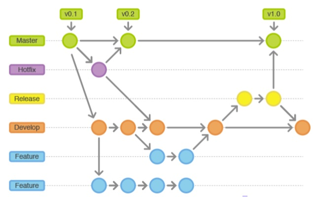
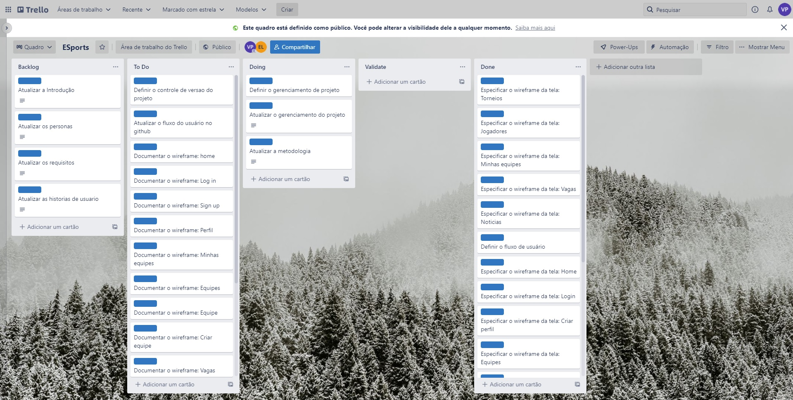
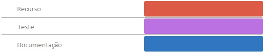

# Metodologia

Pré-requisitos: <a href="02-Especificação do Projeto.md"> Documentação de Especificação</a>

Descreva aqui a metodologia de trabalho do grupo para atacar o problema. Definições sobre os ambiente de trabalho utilizados pela  equipe para desenvolver o projeto. Abrange a relação de ambientes utilizados, a estrutura para gestão do código fonte, além da definição do processo e ferramenta através dos quais a equipe se organiza (Gestão de Times).

## Relação de Ambientes de Trabalho

Os artefatos do projeto são desenvolvidos a partir de diversas plataformas e a relação dos 
ambientes com seu respectivo propósito é apresentada na tabela que se segue.

|Ambiente                         |Plataforma e Link de Acesso                                                                                |
|---------------------------------|-----------------------------------------------------------------------------------------------------------|
|Repositório de código fonte      |[GitHub](https://github.com/ICEI-PUC-Minas-PMV-ADS/pmv-ads-2022-1-e1-proj-web-t4-projetoesports/)          |
|Documentos do projeto            |[GitHub](https://github.com/ICEI-PUC-Minas-PMV-ADS/pmv-ads-2022-1-e1-proj-web-t4-projetoesports/)          |
|Projeto de Interface             |[Figma](https://www.figma.com/file/oozZQHuorZlecy5xe68dPR/Projeto-E-Sports-User-Flow)                      |
|Wireframes                       |[Figma](https://www.figma.com/file/tTFz11ROIuBW1ILmdmAkn5/Projeto-E-Sports-Wireframes)                     |
|Gerenciamento do Projeto         |[Trello](https://trello.com/b/qimVnBUl/esports)                                                            |

## Gestão de código fonte

Para  gestão  do  código  fonte  do  software  desenvolvido  pela  equipe,  o  grupo  utiliza  um 
processo  baseado  no  Git  Flow  abordado  por  Vietro  (2015),  mostrado  na  Figura  a  seguir. 
Desta  forma,  todas  as  manutenções  no  código  são  realizadas  em  branches  separados, 
identificados  como  Hotfix,  Release,  Develop  e  Feature.

## Gerenciamento do Projeto

A equipe utiliza metodologias ágeis, tendo escolhido o Scrum como base para definição do 
processo de desenvolvimento.

- Scrum Master: Vitor Alexandre Gomes Pinto
- Product Owner: Vitor Alexandre Gomes Pinto
- Equipe de Desenvolvimento
  - Carlos Eduardo Favilla Lobo
  - Jéssica Serqueira Pereira
  - João Lucas Pinheiro Torres
  - Pedro Henrique De Freitas Santos
  - Vitor Alexandre Gomes Pinto
- Equipe de Design
  - Carlos Eduardo Favilla Lobo

Para  organização  e  distribuição  das  tarefas  do  projeto,  a  equipe  está  utilizando  o  GitHub 
estruturado com as seguintes listas:

- `Backlog`: recebe  as  tarefas  a  serem  trabalhadas  e  representa  o  Product  Backlog. Todas as atividades identificadas no decorrer do projeto também devem ser incorporadas a esta lista.
- `To Do`: Esta  lista  representa  o  Sprint  Backlog.  Este  é  o  Sprint  atual  que  estamos trabalhando.
- `Doing`: Quando uma tarefa tiver sido iniciada, ela é movida para cá.
- `Validate`: Quando uma tarefa precisa de um parecer do grupo.
- `Test`: Checagem de Qualidade. Quando as tarefas são concluídas, eles são movidas para  o  “CQ”.  No  final  da  semana,  eu  revejo  essa  lista  para  garantir  que  tudo  saiu perfeito.
- `Done`: nesta lista são colocadas as tarefas que passaram pelos testes e controle de qualidade  e  estão  prontos  para  ser  entregues  ao  usuário.  Não  há  mais  edições  ou revisões necessárias, ele está agendado e pronto para a ação.
- `Locked`: Quando alguma coisa impede a conclusão da tarefa, ela é movida para esta lista juntamente com um comentário sobre o que está travando a tarefa.

O quadro kanban do grupo no [GitHub](https://github.com/ICEI-PUC-Minas-PMV-ADS/pmv-ads-2022-1-e1-proj-web-t4-projetoesports/projects/1) é apresentado, no estado atual, na Figura X. A definição desta estrutura se baseou na proposta feita por Littlefield (2016).

As tarefas são, ainda, etiquetadas em função da natureza da atividade e seguem o seguinte esquema de cores/categorias:

