# Projeto de Interface

Pré-requisitos: <a href="03-Especificação do Projeto.md"> Documentação de Especificação</a>

Dentre as preocupações para a montagem da interface do sistema, estamos estabelecendo 
foco em questões como agilidade, acessibilidade e usabilidade. Desta forma, o projeto tem 
uma identidade visual padronizada em todas as telas que são projetadas para funcionamento 
em desktops e dispositivos móveis.

## User Flow

O fluxo da aplicação pode ser representado por dois pontos de vista diferentes, para usuários autenticados e usuários não autenticados. Usuários não autenticados possuem basicamente funções de visualização de informações, usuários autenticados podem interagir de outras formas, incluindo criação de times, cadastro de vagas, entre outras. Segue baixo o fluxo da aplicação para usuários não autenticados.

Em seguida o fluxo para usuários autenticados.

## Wireframes

Conforme  fluxo  de  telas  do  projeto,  apresentado  no  item  anterior,  as  telas  do  sistema  são 
apresentadas em detalhes nos itens que se seguem. As telas do sistema apresentam uma 
estrutura comum que é apresentada na Figura X. Nesta estrutura, existem 3 grandes blocos, 
descritos a seguir. São eles:

- `Barra de navegação de topo`:  local onde estão dispostos todos as funcionalidades ligadas ao usuário;
- `Barra de navegação esquerda`: local onde estão dispostos todos os elementos que auxiliam na navegação pelo site;
- `Conteúdo`: apresenta o conteúdo da tela em questão.

### Tela - Home-Page

Com base na estrutura padrão, o bloco de Conteúdo traz as notícias, torneios e vagas em destaque (título, resumo, imagem). 
O bloco barra de navegação esquerda traz cinco elementos disitintos:
- `Componente Notícias`: leva o usuário para a tela de notícias;
- `Componente Jogadores`: leva o usuário para a tela de busca de jogadores;
- `Componente Vagas`: leva o usuário para a tela de vagas disponíveis em equipes;
- `Componente Equipes `: leva o usuário para a tela de busca por equipes;
- `Componente Torneios `: leva o usuário para a tela de busca por torneios;
 
Quando o usuário estiver deslogado, a barra de navegacão de topo traz o componenente `Entrar` que leva o usuário a tela de login.
 

 
Quando o usuário estiver logado, a barra de navegação de topo traz quatro elementos distintos:
- `Componente Sair`: desloga o usuário do sistema;
- `Componente Perfil`: leva o usuário para a sua tela de perfil;
- `Componente Minhas equipes`: leva o usuário para sua tela de minhas equipes;
- `Componente Notificações `: exibe ao usuário uma janela contendo as últimas notificações.

 
 ### Tela - Log in

A tela de login permite que o usuário acesse a plataforma, inserindo o nome de usuário e senha adquiridos através de um cadastro feito pelo usuário ou um administrador. A tela contém os seguintes elementos:
- `Componente Email`: caixa de texto onde o usuário digitará seu email para autenticação;
- `Componente Senha`: caixa de texto onde o usuário digitará sua senha para autenticação;
- `Componente Esqueceu sua senha?`: redireciona o usuário para a tela de recuperação de senha;
- `Componente Entrar`: botão que confirma a autenticação do usuário e o redireciona para a tela Home-Page;
- `Componente Google`: botão que leva o usuário para a tela de log in do Google;
- `Componente Facebook`: botão que redireciona o usuário para a tela de log in do Facebook;
- `Componente Criar nova conta`: redireciona o usuário a tela de Sign up.

 ### Tela - Sign up
 
A tela de cadastro é uma janela modal e permite cadastrar um usuário com o mínimo de informações possíveis. O usuário deve digitar seu nome, e-mail, senha, confirmação de senha e por fim pressionar o botão registrar. O e-mail deve ser o único registrado no sistema e a senha deve ter no mínimo 6 caracteres. 

### Tela - Recuperar senha

A tela para recuperar senha é uma página que permite ao usuário, recuperar sua senha. Para isso ele deve digitar o e-mail cadastrado e pressionar o botão recuperar senha. Um e-mail com todas as instruções necessárias será encaminhado para o e-mail de cadastro.

### Tela - Perfil

A tela de perfil é uma página que permite visualizar as informações de um determinado usuário, se o usuário em questão está autenticado, será possível editar alguns desses dados. Uma imagem do perfil e exibida no cabeçalho da página, ao lado é possivel visualizar seu nome. No parte direita do cabeçalho, há um botão (três pontinhos) que permite abrir o menu de contexto, onde o usuário pode alterar sua imagem de perfil ou entrar no modo de edição. 

As informações do perfil, estão divididas por seções: sobre, estatísticas e funções. Abaixo segue uma descrição de cada uma delas.  

- `Sobre`: está seção exibe as informações pessoais do usuário: biografia, os times das quais ele já participou e informações para contato; 
- `Estatísticas`: está seção alguns links para sites, especializados em gerar estatísticas de jogos relacionados ao perfil; 
- `Funçôes`: Exibe uma coleção de funções que o jogador pode exercer em determinado jogo. 

### Tela - Equipe

A tela de Equipes permite visualizar o perfil da equipe escolhida e ter acesso a informações dispostas em três abas denominadas "Sobre, Equipe e Vagas".
O usuário tambem tera acesso a um menu de contexto com as opções criar nova vaga, alterar foto de perfil, editar informações da equipe e apagar equipe.

- `Sobre`: Está seção exibe as informações gerais como objetivo e contato.
- `Equipe`: Está seção mostra todos os jogadores e reservas candidatados do time.
- `Vagas`: Exibe as vagas disponíveis conforme a necessidade do time.

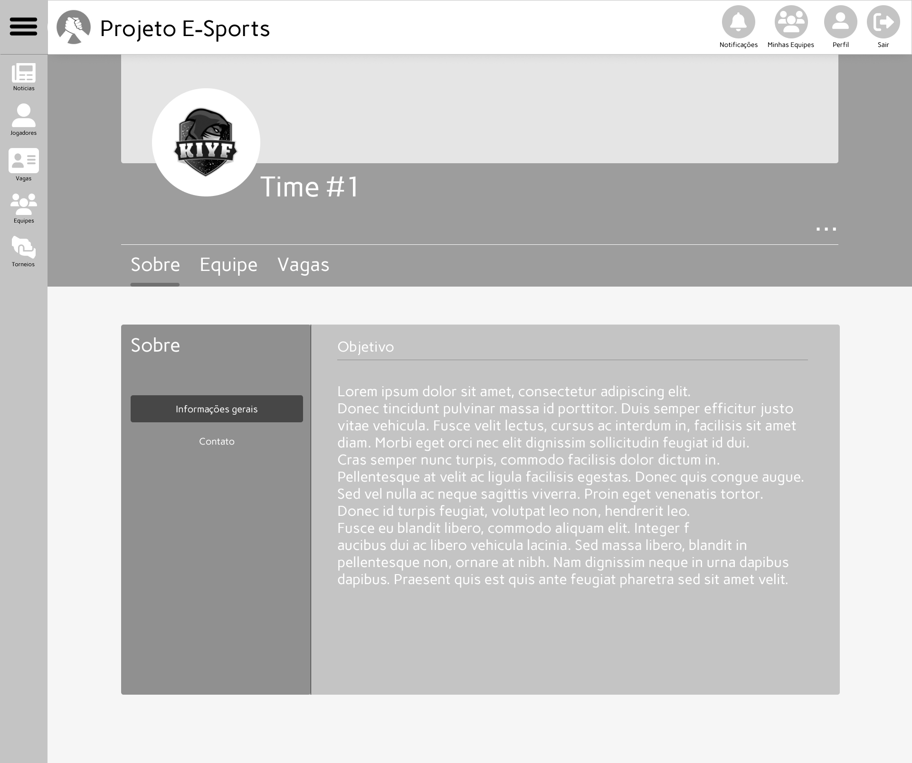

### Tela - Criar vaga

Na tela criar vaga basta selecionar a função para a qual se deseja criar a vaga e pressionar o botão criar vaga. Neste momento os jogadores que em seu perfil habilitaram a opção de notificação, receberão o aviso do sistema.

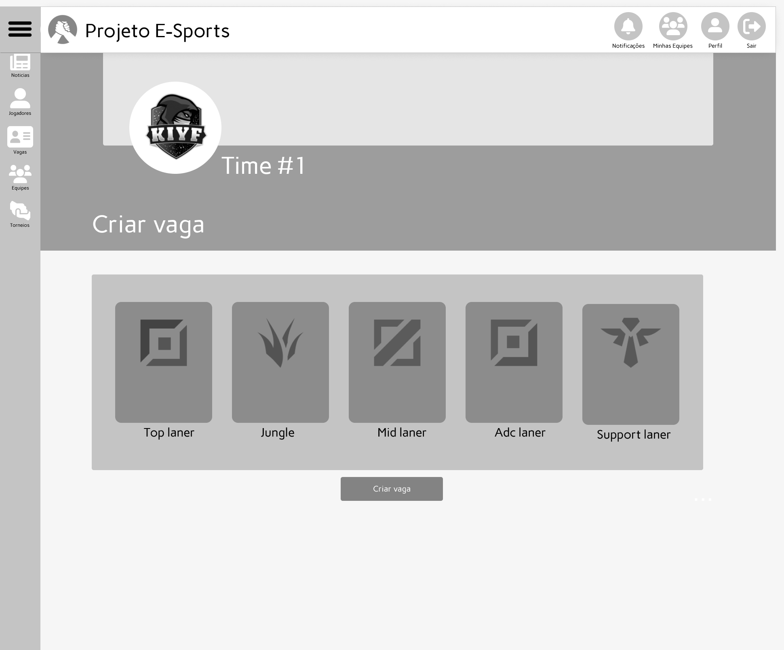

### Tela - Vagas

Em Vagas, podemos visualizar quais times estão solicitando jogadores. Os times ficam divididos em pequenos cards e dentro desses cards temos informações como
ícone, nome do time anunciante, posição de jogador solicitado em forma temática de ícone e um botão para direcionar o usuário a página de inscrição.

- `Barra de pesquisa`: Permite o usuário buscar um time específico de seu interesse.

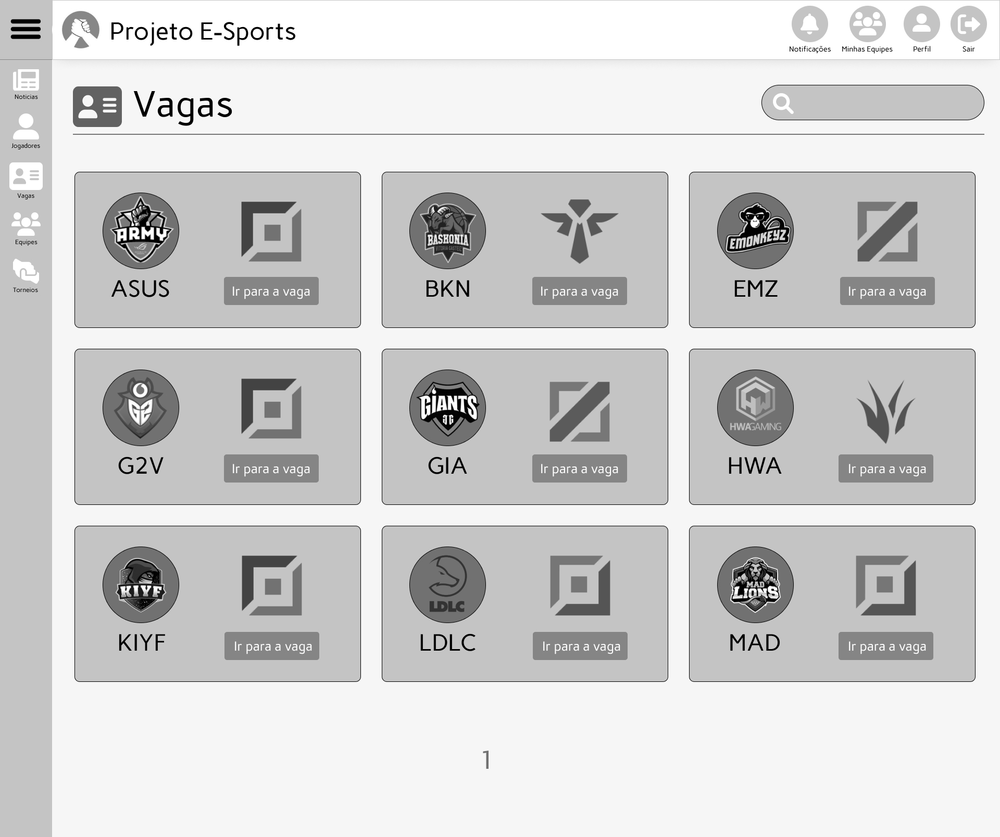

### Tela - Inscrição para a vaga

Na tela de Inscrição, podemos observar diversas funcionalidades. Para o usuário visitante, temos a possibilidade de analisar o perfil do time que estará ofertando a vaga, solicitar ou remover candidatura e visualizar a descrição da vaga. Para administradores é possível visualizar cada candidato com a possibilidade de visitar
seus respectivos perfis apenas clicando no ícone dos mesmos. Após o administrador do time clicar em aceitar abaixo do ícone de um dos candidatos, o menu será limpo
e a vaga fechada.

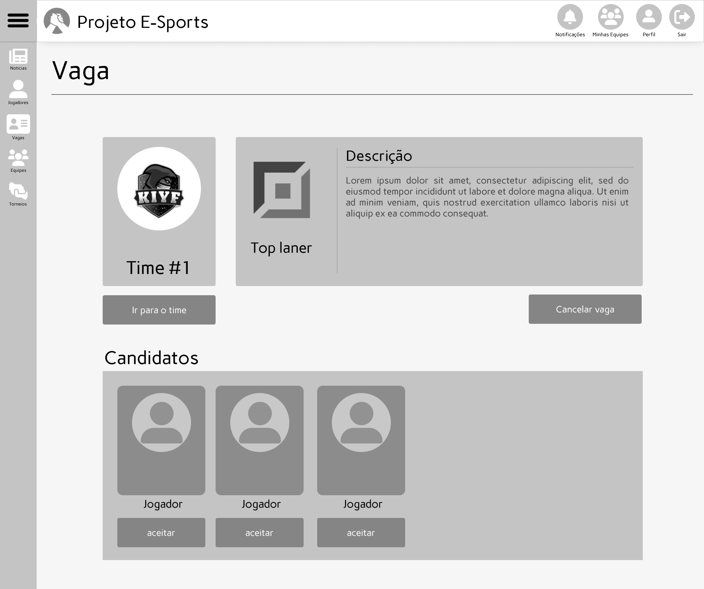

### Tela - Minhas Equipes

Em Minhas Equipes, é possivel visualizar todos os times gerenciados pelo próprio usuário.

- `Criar Equipe`: Direciona o usuário a tela de criação de equipes.

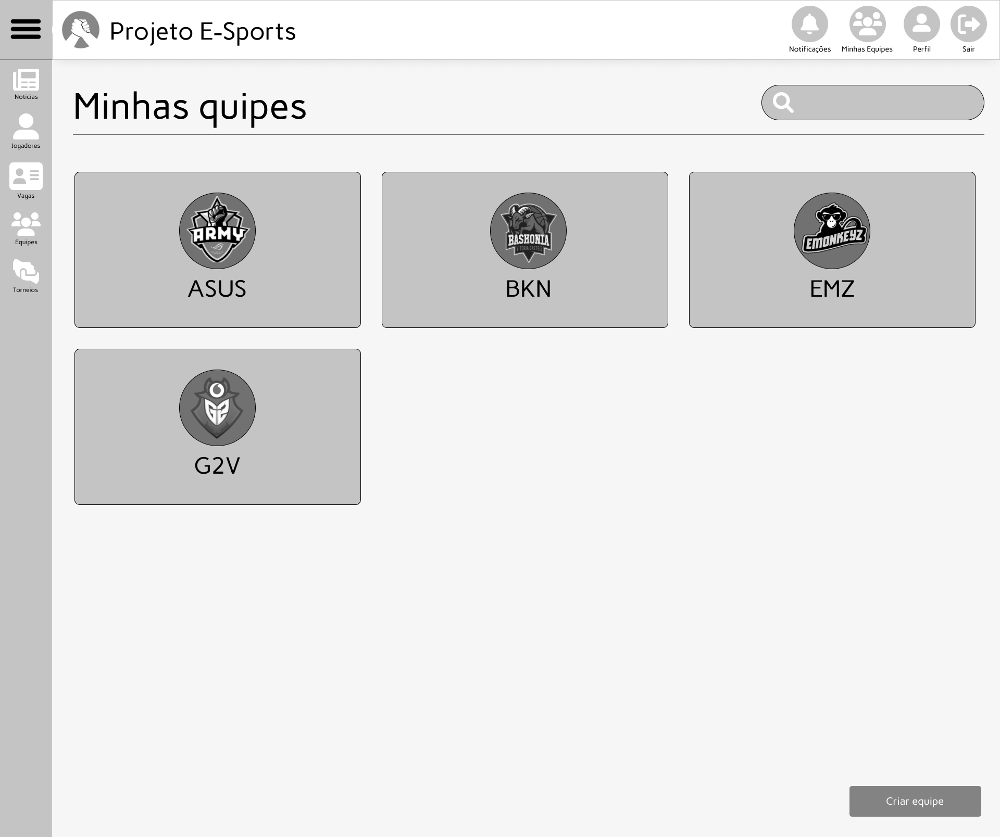

### Tela - Equipes

Na tela de Equipes é possível visualizar uma lista de times criados por outros usuários possibilitando a busca e inspecionamento de perfis alvo.

- `Numeração de páginas`: Os excedentes de times que não aparecem devido a falta de espaço são transferidos para novas páginas que são listadas e enumeradas para uma melhor navegação do usuário.

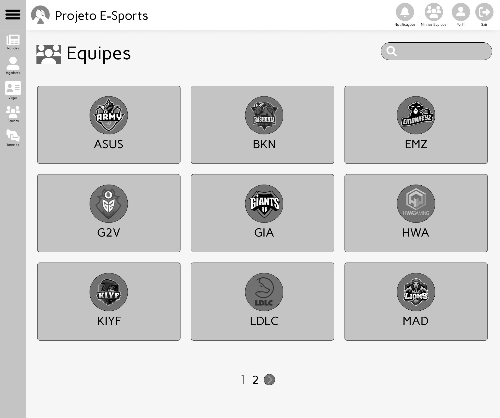

### Tela - Criar Equipe

A tela Criar Equipe é onde ocorre a criação dos times. Nela o usuário deve inserir o nome do time, um email a ser vinculado, o game alvo, a logo e uma breve
descrição sobre o time.

- `Plano de fundo`: Clicando no logo da câmera alem da logo do time pudera ser enviado um plano de fundo da escolha do administrador que ficara visível no perfil do time.

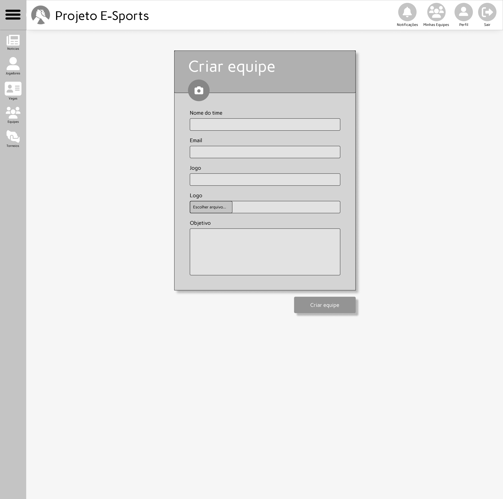

### Tela - Jogadores

Na tela de jogadores, estão listados todos os jogadores do site, sendo possível inspecionar o perfil dos mesmos.

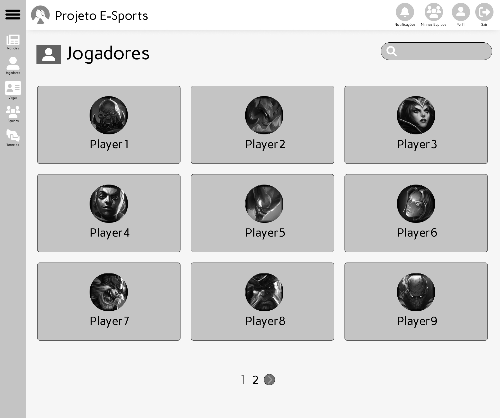

### Tela - Notícias

Na tela de Notícias é possivel visualizar os principais assuntos sobre o mundo dos E-sports, tal como torneios, informações técnicas sobre jogos e coisas do gênero.

- `Cards personalizados`: Cards personalizados com notícias que direcionam o usuário aos principais veículos de informações sobre E-sports.
- `Carrossel`: Notícias mais recentes sempre estarão dispostas em um carroçel para manter o usuário informado.

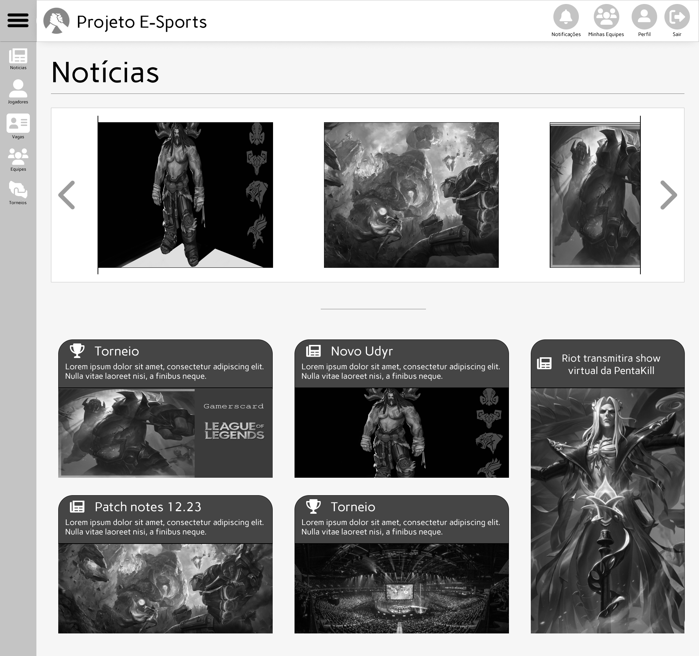

### Tela - Torneios

Na tela de torneio é possível visualizar os principais torneios de E-sports e efetuar buscas por torneios anterioes.

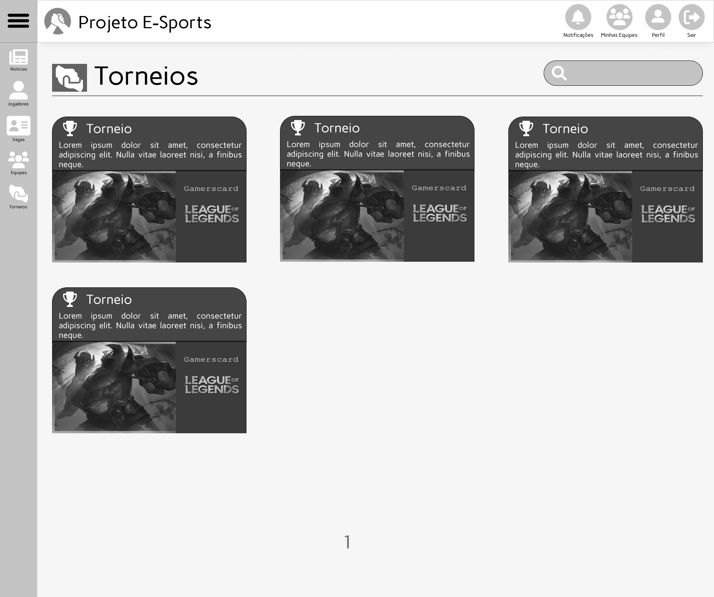

### Tela - Notificações

Na tela de notificações o usuário tem acesso a informações atualizadas sobre o sistema ou processos das quais está participando.

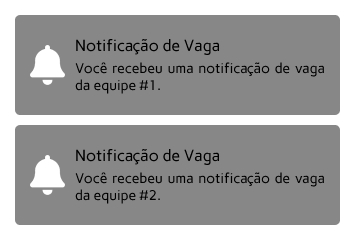

