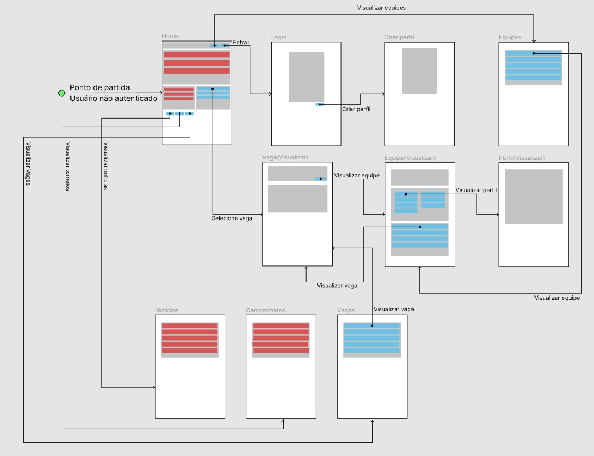

# Projeto de Interface

Pré-requisitos: <a href="2-Especificação do Projeto.md"> Documentação de Especificação</a>

Dentre as preocupações para a montagem da interface do sistema, estamos estabelecendo 
foco em questões como agilidade, acessibilidade e usabilidade. Desta forma, o projeto tem 
uma identidade visual padronizada em todas as telas que são projetadas para funcionamento 
em desktops e dispositivos móveis.

## User Flow

Segue o fluxo para usuários não autenticados.

Em seguida o fluxo para usuários autenticados.

## Wireframes

Conforme  fluxo  de  telas  do  projeto,  apresentado  no  item  anterior,  as  telas  do  sistema  são 
apresentadas em detalhes nos itens que se seguem. As telas do sistema apresentam uma 
estrutura comum que é apresentada na Figura X. Nesta estrutura, existem 3 grandes blocos, 
descritos a seguir. São eles:

- `Barra de navegação de topo`:  local onde estão dispostos todos as funcionalidades ligadas ao usuário;
- `Barra de navegação esquerda`: local onde estão dispostos todos os elementos que auxiliam na navegação pelo site;
- `Conteúdo`: apresenta o conteúdo da tela em questão.

