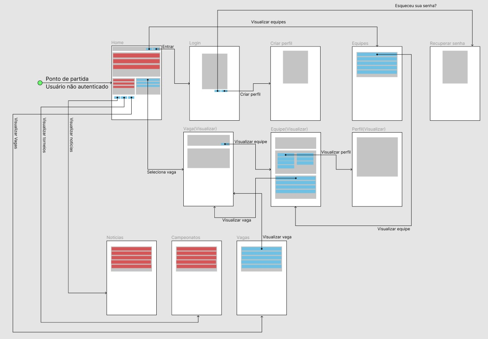
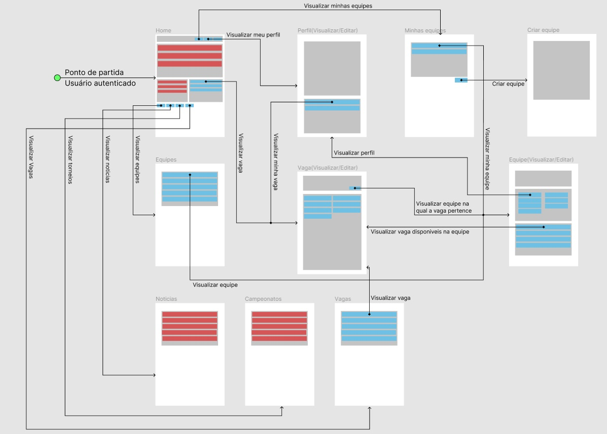
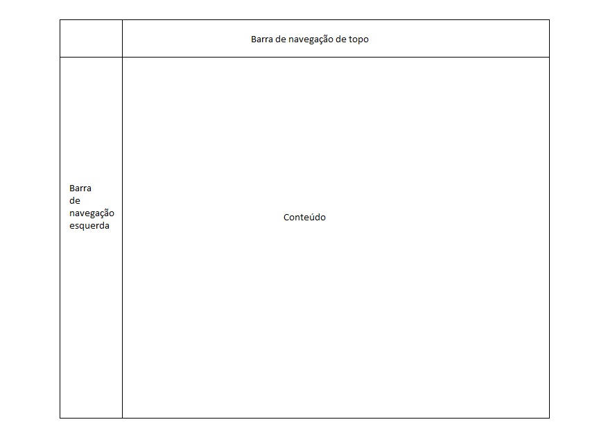
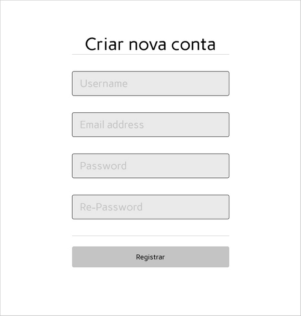
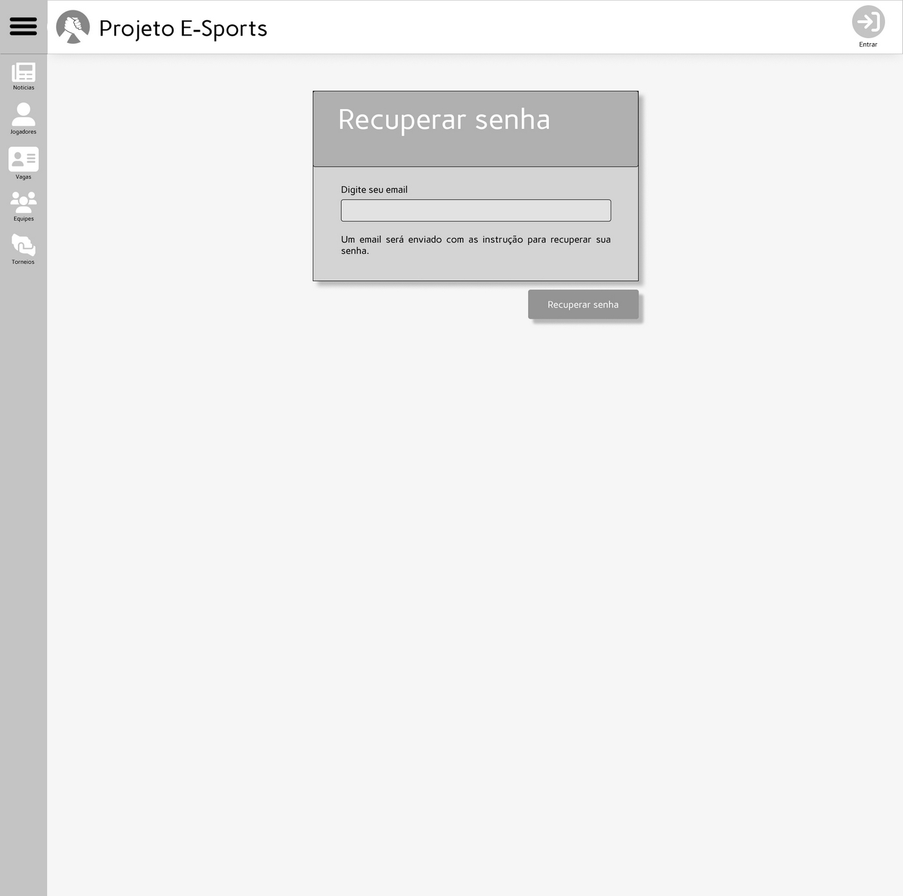
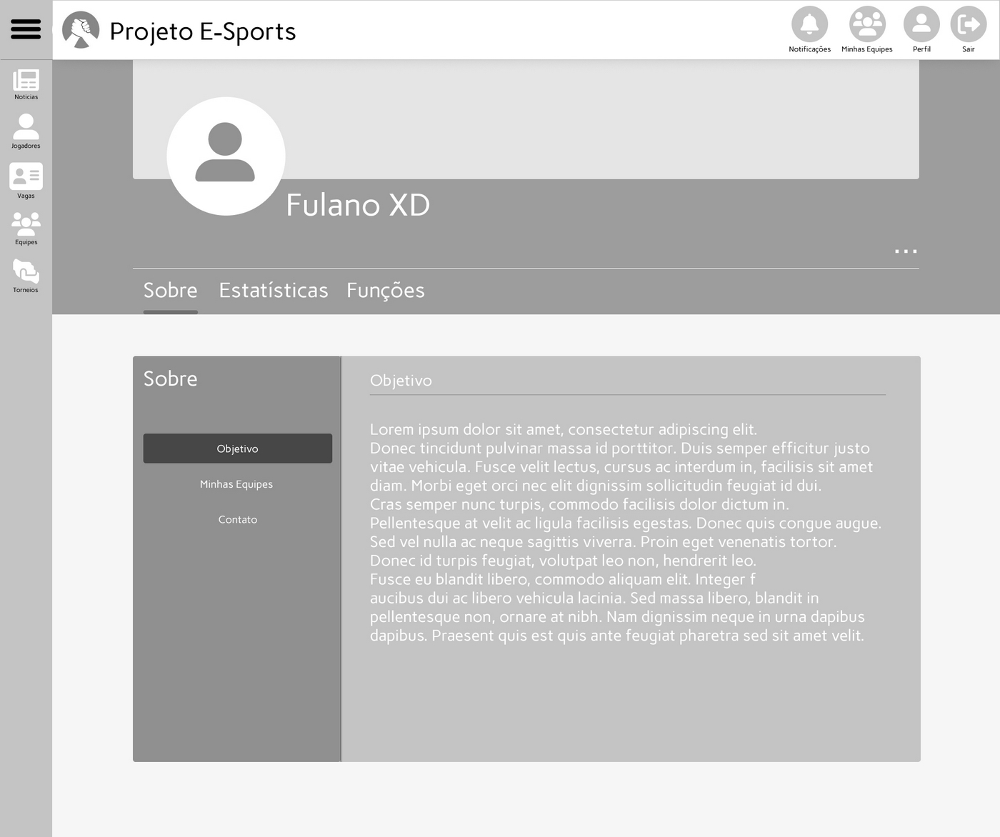

# Projeto de Interface

Pré-requisitos: <a href="2-Especificação do Projeto.md"> Documentação de Especificação</a>

Dentre as preocupações para a montagem da interface do sistema, estamos estabelecendo 
foco em questões como agilidade, acessibilidade e usabilidade. Desta forma, o projeto tem 
uma identidade visual padronizada em todas as telas que são projetadas para funcionamento 
em desktops e dispositivos móveis.

## User Flow

Segue o fluxo para usuários não autenticados.

Em seguida o fluxo para usuários autenticados.

## Wireframes

Conforme  fluxo  de  telas  do  projeto,  apresentado  no  item  anterior,  as  telas  do  sistema  são 
apresentadas em detalhes nos itens que se seguem. As telas do sistema apresentam uma 
estrutura comum que é apresentada na Figura X. Nesta estrutura, existem 3 grandes blocos, 
descritos a seguir. São eles:

- `Barra de navegação de topo`:  local onde estão dispostos todos as funcionalidades ligadas ao usuário;
- `Barra de navegação esquerda`: local onde estão dispostos todos os elementos que auxiliam na navegação pelo site;
- `Conteúdo`: apresenta o conteúdo da tela em questão.

### Tela - Home-Page

Com base na estrutura padrão, o bloco de Conteúdo traz as notícias, torneios e vagas em destaque (título, resumo, imagem). 
O bloco barra de navegação esquerda traz cinco elementos disitintos:
- `Componente Notícias`: leva o usuário para a tela de notícias;
- `Componente Jogadores`: leva o usuário para a tela de busca de jogadores;
- `Componente Vagas`: leva o usuário para a tela de vagas disponíveis em equipes;
- `Componente Equipes `: leva o usuário para a tela de busca por equipes;
- `Componente Torneios `: leva o usuário para a tela de busca por torneios;
 
Quando o usuário estiver deslogado, a barra de navegacão de topo traz o componenente `Entrar` que leva o usuário a tela de login.
 

 
Quando o usuário estiver logado, a barra de navegação de topo traz quatro elementos distintos:
- `Componente Sair`: desloga o usuário do sistema;
- `Componente Perfil`: leva o usuário para a sua tela de perfil;
- `Componente Minhas equipes`: leva o usuário para sua tela de minhas equipes;
- `Componente Notificações `: exibe ao usuário uma janela contendo as últimas notificações.

 
 ### Tela - Log in

A tela de login permite que o usuário acesse a plataforma, inserindo o nome de usuário e senha adquiridos através de um cadastro feito pelo usuário ou um administrador. A tela contém os seguintes elementos:
- `Componente Email`: caixa de texto onde o usuário digitará seu email para autenticação;
- `Componente Senha`: caixa de texto onde o usuário digitará sua senha para autenticação;
- `Componente Esqueceu sua senha?`: redireciona o usuário para a tela de recuperação de senha;
- `Componente Entrar`: botão que confirma a autenticação do usuário e o redireciona para a tela Home-Page;
- `Componente Google`: botão que leva o usuário para a tela de log in do Google;
- `Componente Facebook`: botão que redireciona o usuário para a tela de log in do Facebook;
- `Componente Criar nova conta`: redireciona o usuário a tela de Sign up.

 ### Tela - Sign up
 
A tela de cadastro é uma janela modal e permite cadastrar um usuário com o mínimo de informações possíveis. O usuário deve digitar seu nome, e-mail, senha, confirmação de senha e por fim pressionar o botão registrar. O e-mail deve ser o único registrado no sistema e a senha deve ter no mínimo 6 caracteres. 

### Tela - Recuperar senha

A tela para recuperar senha é uma página que permite ao usuário, recuperar sua senha. Para isso ele deve digitar o e-mail cadastrado e pressionar o botão recuperar senha. Um e-mail com todas as instruções necessárias será encaminhado para o e-mail de cadastro.

### Tela - Perfil

A tela de perfil é uma página que permite visualizar as informações de um determinado usuário, se o usuário em questão está autenticado, será possível editar alguns desses dados. Uma imagem do perfil e exibida no cabeçalho da página, ao lado é possivel visualizar seu nome. No parte direita do cabeçalho, há um botão (três pontinhos) que permite abrir o menu de contexto, onde o usuário pode alterar sua imagem de perfil ou entrar no modo de edição. 

As informações do perfil, estão divididas por seções: sobre, estatísticas e funções. Abaixo segue uma descrição de cada uma delas.  

- `Sobre`: está seção exibe as informações pessoais do usuário: biografia, os times das quais ele já participou e informações para contato; 
- `Estatísticas`: está seção alguns links para sites, especializados em gerar estatísticas de jogos relacionados ao perfil; 
- `Funçôes`: Exibe uma coleção de funções que o jogador pode exercer em determinado jogo. 

