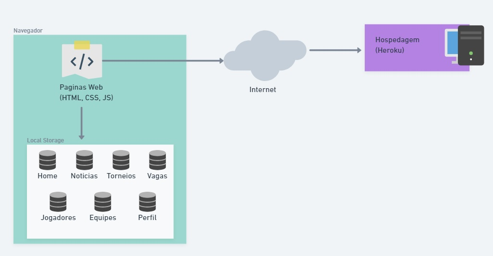

# Arquitetura da Solução

Pré-requisitos: <a href="04-Projeto de Interface.md"> Projeto de Interface</a>

Nesta seção são apresentados os detalhes técnicos da solução criada pela equipe, tratando dos componentes que fazem parte da solução e do ambiente de hospedagem da solução.

## Diagrama de componentes

Diagrama que permite a modelagem física de um sistema, através da visão dos seus componentes e relacionamentos entre os mesmos.

Os componentes que fazem parte da solução são apresentados na figura que segue.

Arquitetura da Solução

A solução implementada conta com os seguintes módulos:
- **Navegador** - Interface básica do sistema  
  - **Páginas Web** - Conjunto de arquivos HTML, CSS, JavaScript e imagens que implementam as funcionalidades do sistema.
   - **Local Storage** - armazenamento mantido no Navegador, onde são implementados bancos de dados baseados em JSON. São eles: 
     - **Home** - seção com todas as informações necessárias para alimentar a página home.
     - **Noticias** - lista de notícias mantidas para leitura.
     - **Torneios** - lista de torneios mantidas para acesso posterior.
     - **Vagas** - lista de vagas mantidas para acesso posterior.
     - **Jogadores** - lista de jogadores mantidas acesso.
     - **Equipes** - lista de equipes mantidas para acesso.
     - **Perfil** - contém as informações do perfil autenticado no sistema.
 - **Hospedagem** - local na Internet onde as páginas são mantidas e acessadas pelo navegador.

## Hospedagem

O site utiliza a plataforma do Heroku como ambiente de hospedagem do site do projeto. O 
site é mantido no ambiente da URL:

[https://esports-app-puc.herokuapp.com/](https://esports-app-puc.herokuapp.com/)

A publicação do site no Heroku é feita por meio de uma submissão do projeto (push) via git 
para o repositório remoto que se encontra no endereço: 

[https://git.heroku.com/esports-app-puc.git](https://git.heroku.com/esports-app-puc.git)
