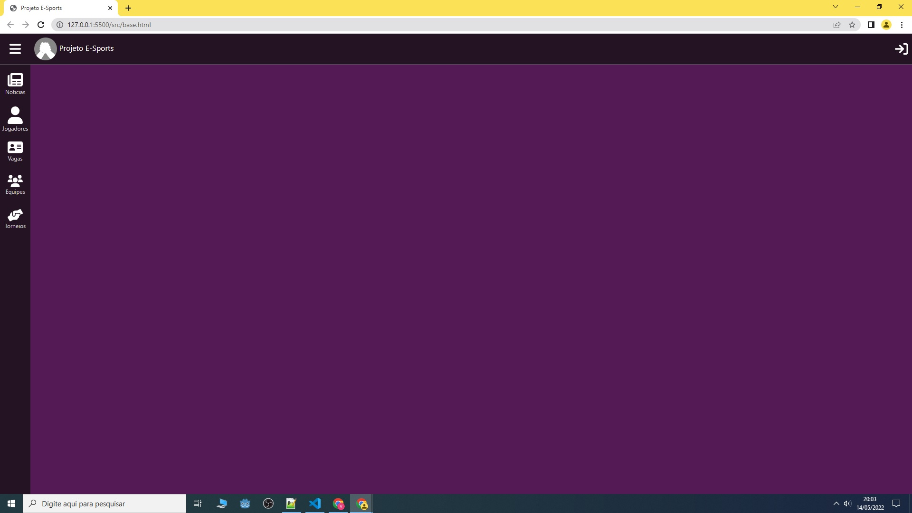

# Template padrão do site

Pré-requisitos: <a href="2-Especificação do Projeto.md"> Especificação do Projeto</a>, <a href="3-Projeto de Interface.md"> Projeto de Interface</a>, <a href="4-Metodologia.md"> Metodologia</a>

O  padrão  de  layout  a  ser  utilizado  pelo  site  tem  correspondência  ao  projeto  de  interface 
elaborado anteriormente. É composto basicamente pela tela principal com uma barra de atalho lateral, com as pricipais opções do site. E
a barra de topo que fornece acesso as funcionalidade ligadas ao usuário.

