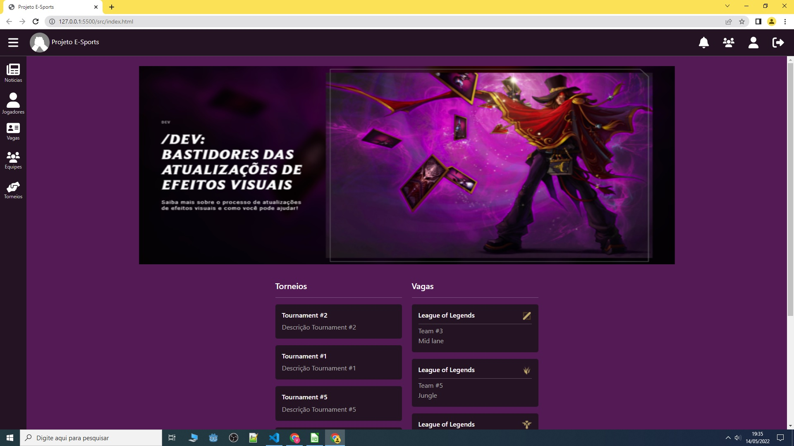
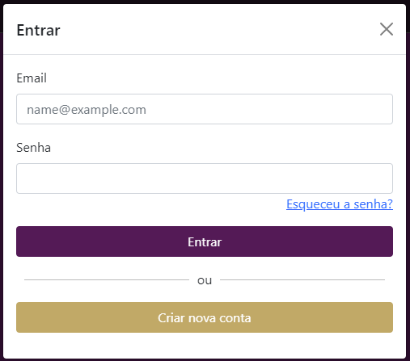
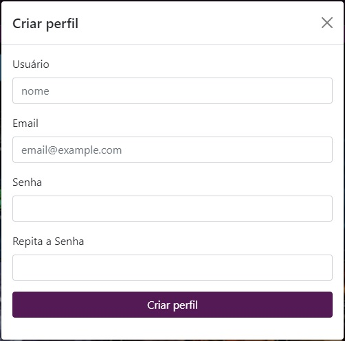
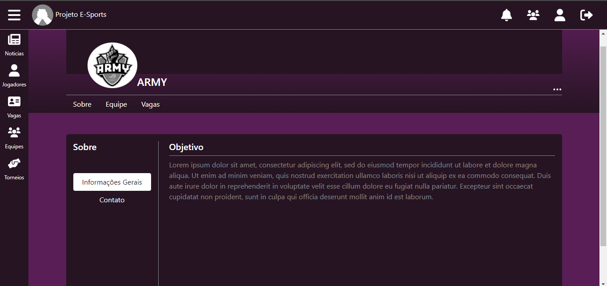
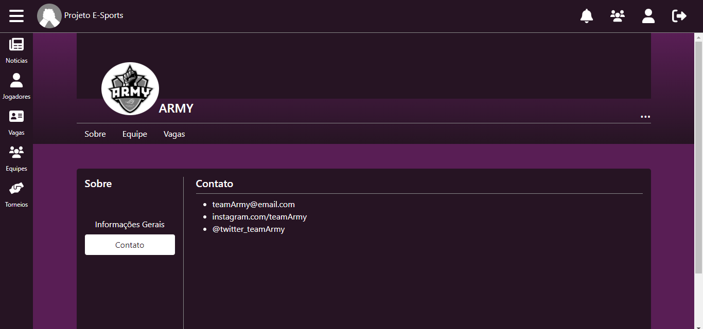
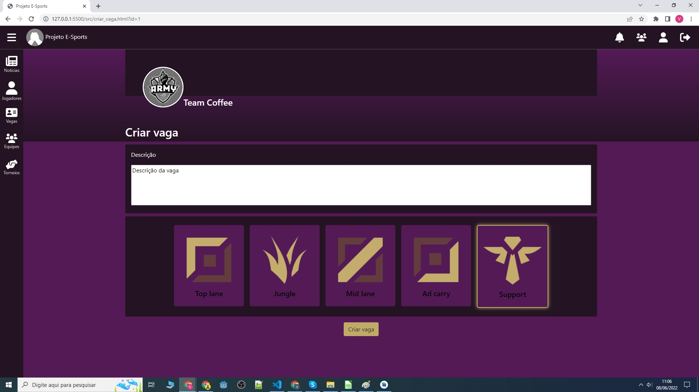

# Programação de Funcionalidades

<span style="color:red">Pré-requisitos: <a href="2-Especificação do Projeto.md"> Especificação do Projeto</a></span>, <a href="3-Projeto de Interface.md"> Projeto de Interface</a>, <a href="4-Metodologia.md"> Metodologia</a>, <a href="3-Projeto de Interface.md"> Projeto de Interface</a>, <a href="5-Arquitetura da Solução.md"> Arquitetura da Solução</a>

## Tela home(RF-01, RF-03, RF-04, RF-05, RF-22)

A tela principal do sistema tem como objetivo integrar o usuário ao ambiente competitivo, desta forma ela apresenta até 5 notícias recentes sobre o cenário, permite visualizar até 5 vagas recentes notificadas pelos times e listar até 5 torneios recentes que estão em andamento.
Por ela também e possível se autenticar no sistema ou criar um novo usuário. Uma vez autenticado, o usuário pode navegar para a página com informações do perfil, visualizar as notificações recebidas, pode navegar para a página de suas equipes e também e possível sair do perfil.
Através do menu lateral, ele pode navegar por diferentes seções que fornecem acesso a outros recursos do sistema.



Este é o modal de login, por ele é possível se autenticar no sistema, fornecendo o e-mail e a senha de acesso. 



Este é o modal de registro, por ele é possível se cadastrar no sistema, fornecendo apenas informações essenciais para cadastro.



### Requisitos atendidos
  - RF-01
  - RF-03
  - RF-04
  - RF-05
  - RF-22

### Artefatos
  - index.html
  - js/controllers/home.js
  - js/components/pages/home
  - css/home.css
  - imgs/noticias_images
  - imgs/torneio_images
  - imgs/role_lane_icons

### Estrutura de dados

```
  {
    "userInfo": {
      "id":1,
      "name":"John",
      "email":"john@email.com",
      "password":"a665a45920422f9d417e4867efdc4fb8a04a1f3fff1fa07e998e86f7f7a27ae3"
    },
    "news": [
      {
        "id":2,
        "title":"News #2",
        "description":"Descrição News #2",
        "carousel_img_url":"imgs/noticias_images/noticias_2.png",
        "url":"https://www.google.com",
        "created_at":1652281098729
      },
    ],
    "tournaments": [
      {
        "id":2,
        "name":"Tournament #2",
        "description":"Descrição Tournament #2",
        "url":"url",
        "created_at":1652281498729
      }
    ],
    "vacancies": [
      {
        "id":3,
        "game":"League of Legends",
        "team":"Team #3",
        "role":"Mid lane",
        "icon_url":"imgs/role_lane_icons/MIDDLE.png",
        "created_at":1652212098729
      }
    ]
  }
```

## Criar Equipe

A tela Criar Equipe possui um formulário onde o usuário pode castrar sua equipe. Para o cadastro é necessário preencher os dados: Nome, Email, Jogo, Logo e Objetivo.


### Requisitos atendidos

- RF-08
- RF-09

### Artefatos da funcionalidade

- feature_equipes.html
- equipe.css
- icon_time.png
- models.js
- team.js

### Estrutura de Dados

```
{
    "id":1,
    "name":"",
    "game_id":"",
    "icon_url":"",
    "objective":"",
    "players":null,
    "reserves":null,
    "vacancies":null,
    "contacts":null
}
```

## Perfil do usuário

A tela "perfil do usuário" é dividida em três categorias. Sobre, estatísticas e função. Essas abas possuem informações diversas sobre o usuário. Facilitando a analise de perfil do mesmo por outros usuários que buscam por jogadores específicos. Após a criação de perfil o usuário poderá inserir informações tais como contato, um breve resumo do seu objetivo na área, histórico de equipes, links externos com estatísticas do usuário em determinado jogo e funções atualmente ocupadas.


### Requisitos atendidos

- RF-01
- RF-06

### Artefatos da funcionalidade

- src/css/perfil.css
- src/perfil.html
- src/js/models/user.js
- src/img/RC.png

```
{
    "id":123321,
    "name":"jose",
    "email":"jose@gmail.com",
    "password":"Nankinjo",
    "img_url":"imgs/RC.png",
    "objective":"Lorem ipsum dolor sit amet consectetur adipisicing elit.",
    "participated_teams":null,
    "contact_info":null,
    "game_statistics":null,
    "game_roles":null
}
```
## Equipes
 
A tela  de equipes mostra todas as equipes que o usuario está cadastrado.
 
 

### Requisitos atendidos

- RF-02
- RF-15

### Artefatos da funcionalidade

- sports_feature
- styke.css
- script.js
- node_modules
- index.html

### Estrutura de Dados

$(function() {

    $(".toggle").on("click", function() {
        if ($(".item").hasClass("active")) {
            $(".item").removeClass("active");
        } else {
            $(".item").addClass("active");
        }
    });
});

## Tela de busca por vagas em equipes

A tela de buscas por vagas em equipes lista todas as vagas em aberto do site de forma paginada e permite ao usuário as filtrar através de uma barra de pesquisa e as consultar através do botão "Ir para vaga", que o redireciona para a Tela de Informação sobre a Vaga.


### Requisitos atendidos

- RF-02
- RF-13
- RF-19

### Artefatos da funcionalidade

- src/css/vagas_equipes.css
- src/vagas_equipes.html
- src/js/controllers/vagas_equipes.js
- src/imgs

### Estrutura de Dados

```
{
  "teams": [
      {
        "id":1,
        "name":"ASUS",
        "game_id":"1",
        "icon_url":"imgs/icone_time.png",
        "objective":"Lorem ipsum dolor sit amet consectetur adipisicing elit.",
        "players":null,
        "reserves":null,
        "vacancies":null,
        "contacts":null
      }
    ],
"vacancies": [
      {
        "id":3,
        "game":"League of Legends",
        "team":"Team #1",
        "role":"Top lane",
        "icon_url":"imgs/icone_posicao_top.png",
        "created_at":1652212098729
      }
    ]
}
```
## Tela de Informações sobre Equipe

A tela de Informações sobre Equipe permitirá que o usuário se atualize sobre o time, tendo acesso a informações gerais ou informações de contato.




### Requisitos atendidos

- RF-02
- RF-09

### Artefatos da funcionalidade

- equipe_contato.html
- equipe_informacoes_gerais.html
- team.js
- equipe.css
- icon_time.png

### Estrutura de Dados

```
{    
  "id" = 1;
  "name" = "ARMY";    
  "email" = "teamArmy@email.com";
  "game_id" = game_id;
  "icon_url" = icon_url;
  "objective" = null;
  "players" = null;
  "reserves" = null;
  "vacancies" = null;
  "contacts" = ["instagram.com/teamArmy", "@twitter_teamArmy"];
}
```

## Tela de vaga

A tela de vaga permitirá a todos os usuários do site visualizar informações sobre uma vaga, ao jogador se inscrever na vaga e ao adminitrador convidar um jogador a fazer parte do time.


### Requisitos atendidos

- RF-10
- RF-23
- RF-24
- RF-25
- RF-26
- RF-27
- RF-28

### Artefatos da funcionalidade

- vaga.html
- js/controllers/vaga.js

### Estrutura de Dados

```
{
  "user": {
    "id": 1,
    "name": "John",
    "email": "john@email.com",
    "password": "a665a45920422f9d417e4867efdc4fb8a04a1f3fff1fa07e998e86f7f7a27ae3",
    "img_url": "imgs/RC.png",
    "objective": "Lorem ipsum dolor sit amet consectetur adipisicing elit. Veritatis, minima.",
    "participated_teams": [],
    "contact_info": ["john@email.com"],
    "game_statistics": ["https://oce.op.gg/summoners/br/john_cabure"],
    "game_roles": [],
    "receive_new_vacancies_notification": true
  },
  "team":{
    "id":1,
    "name":"Team Coffee",
    "email":"team_coffee_org@email.com",
    "owner_id":2,
    "game_id":1,
    "icon_url":"imgs/team_icons/team_coffee.png",
    "objective":"Lorem ipsum dolor sit amet consectetur adipisicing elit. Veritatis, minima.",
    "players":[4,5,3],
    "active_players":[4],
    "reserves":[5,3],
    "vacancies":[1,2],
    "contacts":["team_coffee_org@email.com","@team_coffee_org"]    
  },
  "role":{
    "id":1,
    "name":"Top lane",
    "game_id":1,
    "icon_url":"imgs/role_lane_icons/TOP.png"
  },
  "vacancy": {    
    "id": 3,
    "description": "skdajd askdj askj ksafjklsaj fasdf kjl",
    "team_id": 1,
    "role_id": 4,
    "candidates": [],
    "finalized": false,
    "pending_invite_from": null,
    "created_at": 1654039213509
  }
}
```

## Tela para criar vaga

A tela criar vaga permitirá que o adminitrador de um time, crie uma vaga para preencher uma determinada função no time e notifique os jogadores interessados.



### Requisitos atendidos

- RF-21

### Artefatos da funcionalidade

- criar_vaga.html
- js/controllers/criar_vaga.js

### Estrutura de Dados

```
{
  "user": {
    "id": 1,
    "name": "John",
    "email": "john@email.com",
    "password": "a665a45920422f9d417e4867efdc4fb8a04a1f3fff1fa07e998e86f7f7a27ae3",
    "img_url": "imgs/RC.png",
    "objective": "Lorem ipsum dolor sit amet consectetur adipisicing elit. Veritatis, minima.",
    "participated_teams": [],
    "contact_info": ["john@email.com"],
    "game_statistics": ["https://oce.op.gg/summoners/br/john_cabure"],
    "game_roles": [],
    "receive_new_vacancies_notification": true
  },
  "team":{
    "id":1,
    "name":"Team Coffee",
    "email":"team_coffee_org@email.com",
    "owner_id":2,
    "game_id":1,
    "icon_url":"imgs/team_icons/team_coffee.png",
    "objective":"Lorem ipsum dolor sit amet consectetur adipisicing elit. Veritatis, minima.",
    "players":[4,5,3],
    "active_players":[4],
    "reserves":[5,3],
    "vacancies":[1,2],
    "contacts":["team_coffee_org@email.com","@team_coffee_org"]    
  },
  "role":{
    "id":1,
    "name":"Top lane",
    "game_id":1,
    "icon_url":"imgs/role_lane_icons/TOP.png"
  },
  "vacancy": {    
    "id": 3,
    "description": "skdajd askdj askj ksafjklsaj fasdf kjl",
    "team_id": 1,
    "role_id": 4,
    "candidates": [],
    "finalized": false,
    "pending_invite_from": null,
    "created_at": 1654039213509
  }
}
```
