# Plano de Testes de Software

Pré-requisitos: <a href="2-Especificação do Projeto.md"> Especificação do Projeto</a>, <a href="3-Projeto de Interface.md"> Projeto de Interface</a>

Os requisitos para realização dos testes de software são:

  * Site publicado na Internet
  * Navegador da Internet - Chrome, Firefox ou Edge
  * Conectividade de Internet

Os testes funcionais a serem realizados no aplicativo são descritos a seguir.

Tabela de teste CT-01

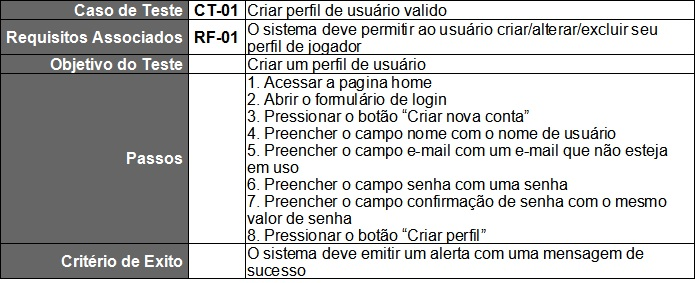

Tabela de teste CT-02

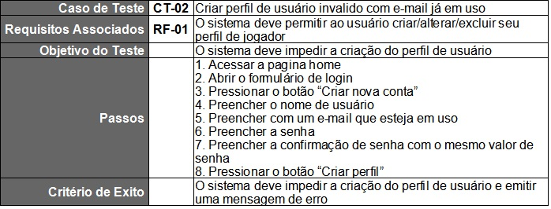

Tabela de teste CT-03

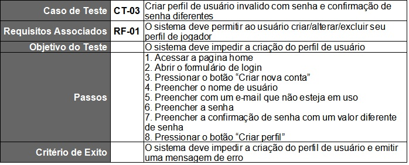

Tabela de teste CT-04

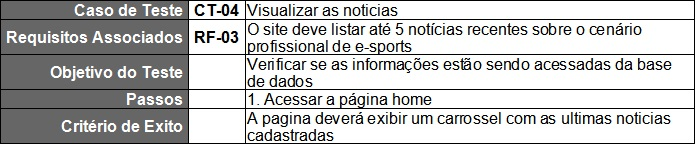

Tabela de teste CT-05

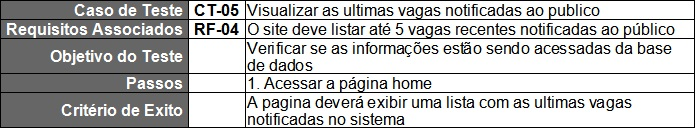

Tabela de teste CT-06

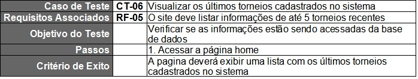

Tabela de teste CT-07

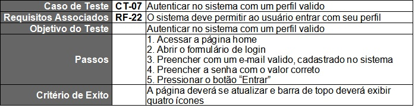

Tabela de teste CT-08

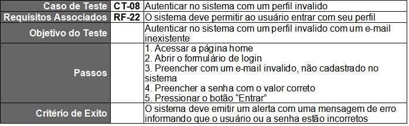

Tabela de teste CT-09

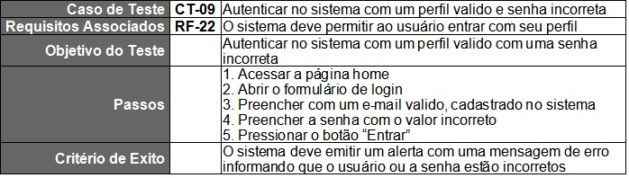

Tabela de teste CT-10

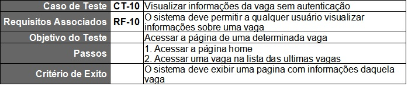

Tabela de teste CT-11

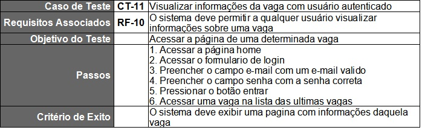

Tabela de teste CT-12

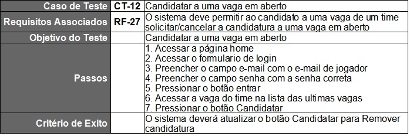

Tabela de teste CT-13

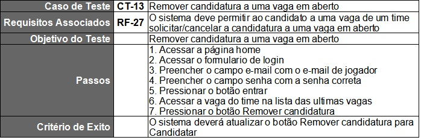

Tabela de teste CT-14

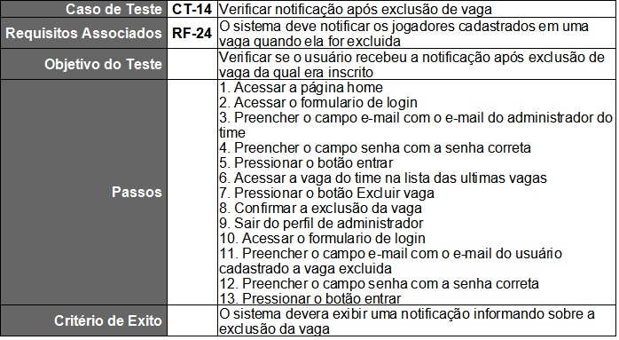

Tabela de teste CT-15

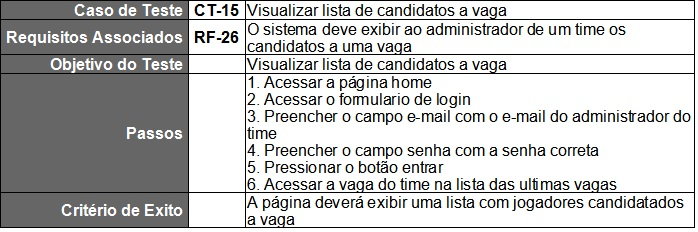

Tabela de teste CT-16

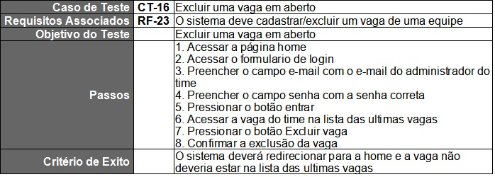

Tabela de teste CT-17

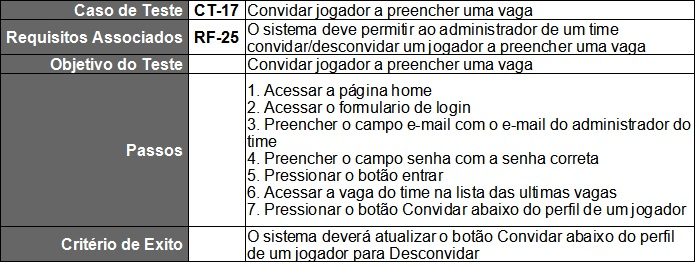

Tabela de teste CT-18

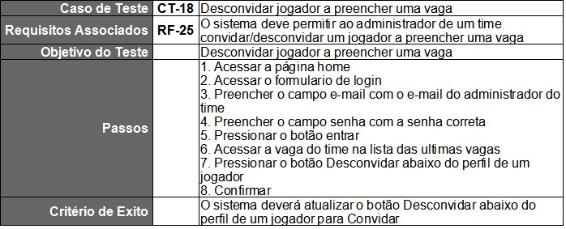

Tabela de teste CT-19

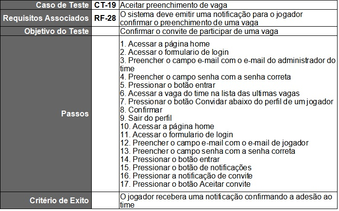

Tabela de teste CT-20

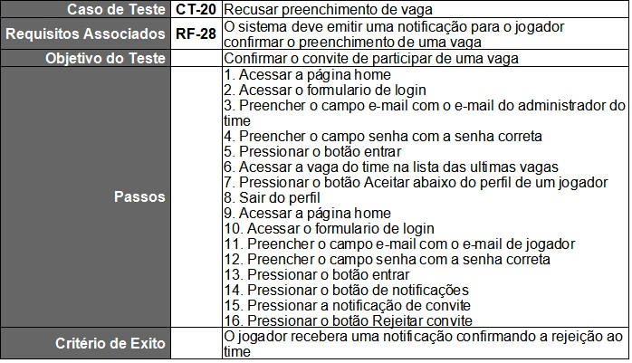

Tabela de teste CT-21

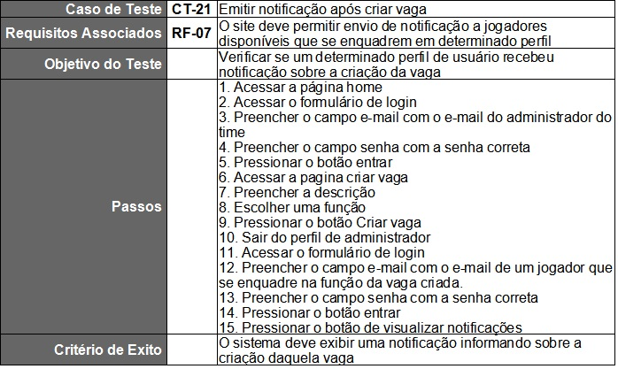

Tabela de teste CT-22

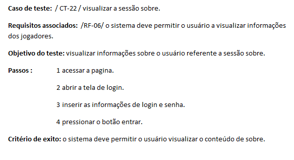
     
Tabela de teste CT-23

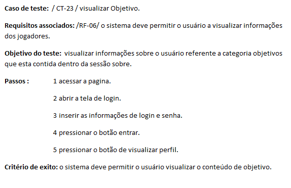

Tabela de teste CT-24

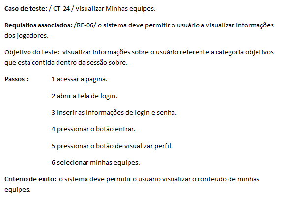

Tabela de teste CT-25

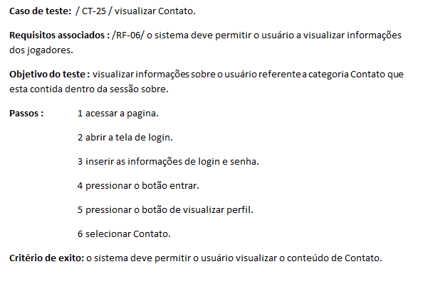

Tabela de teste CT-26

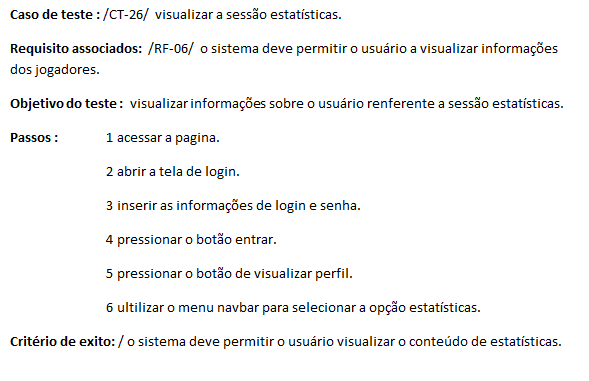

Tabela de teste CT-27

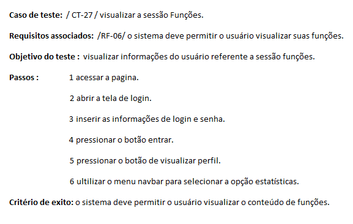

Tabela de teste CT-28

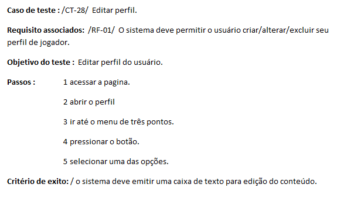

Tabela de teste CT-29

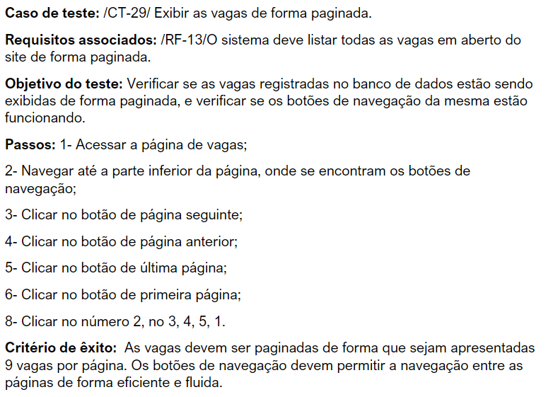

Tabela de teste CT-30

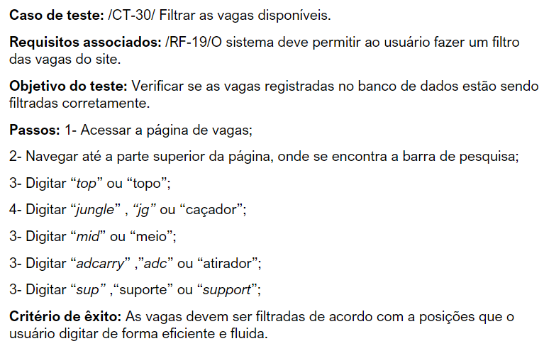

Tabela de teste CT-31

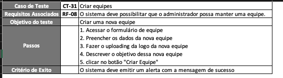

Tabela de teste CT-32

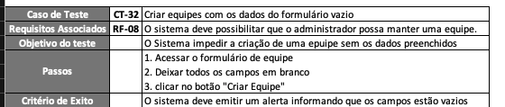

Tabela de teste CT-33

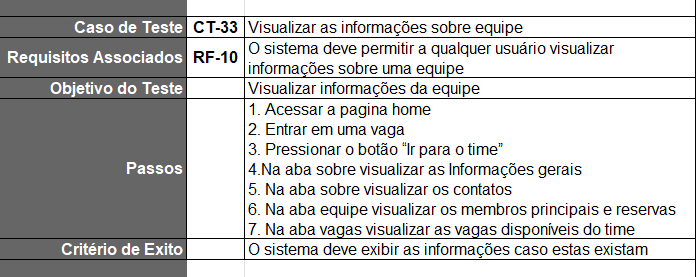

Tabela de teste CT-34

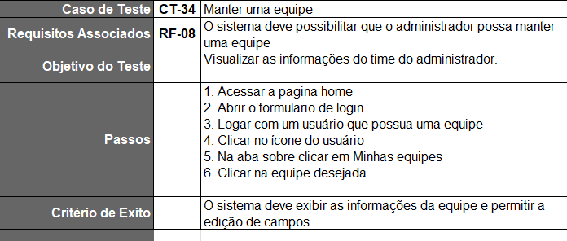

Tabela de teste CT-35

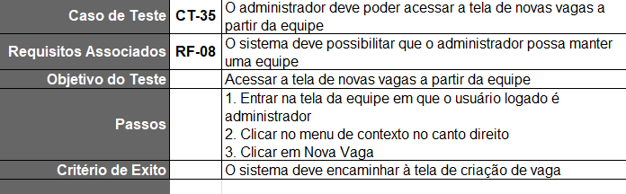

Tabela de teste CT-36

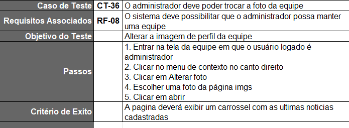

Tabela de teste CT-37

Tabela de teste CT-38

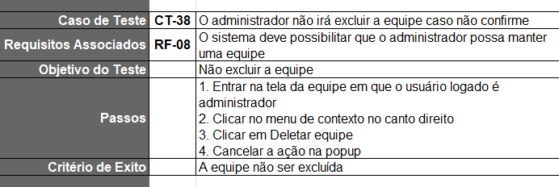

Tabela de teste CT-39

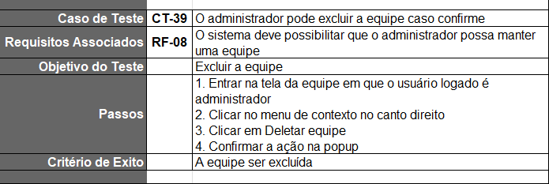

Tabela de teste CT-40

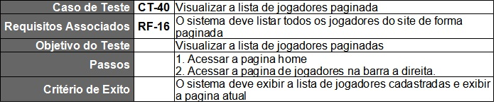

Tabela de teste CT-41

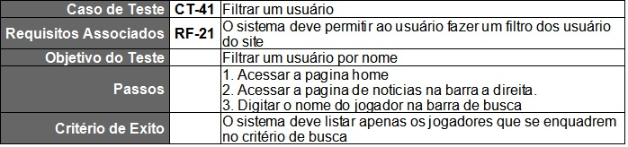

Tabela de teste CT-42

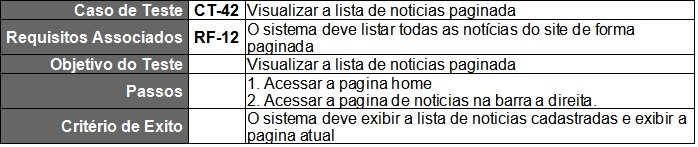

Tabela de teste CT-43

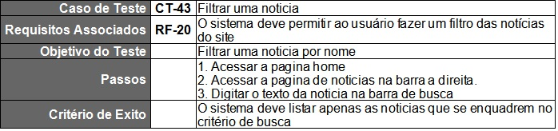

Tabela de teste CT-44

Tabela de teste CT-45

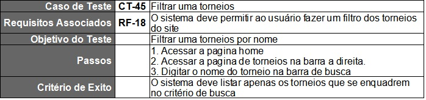
