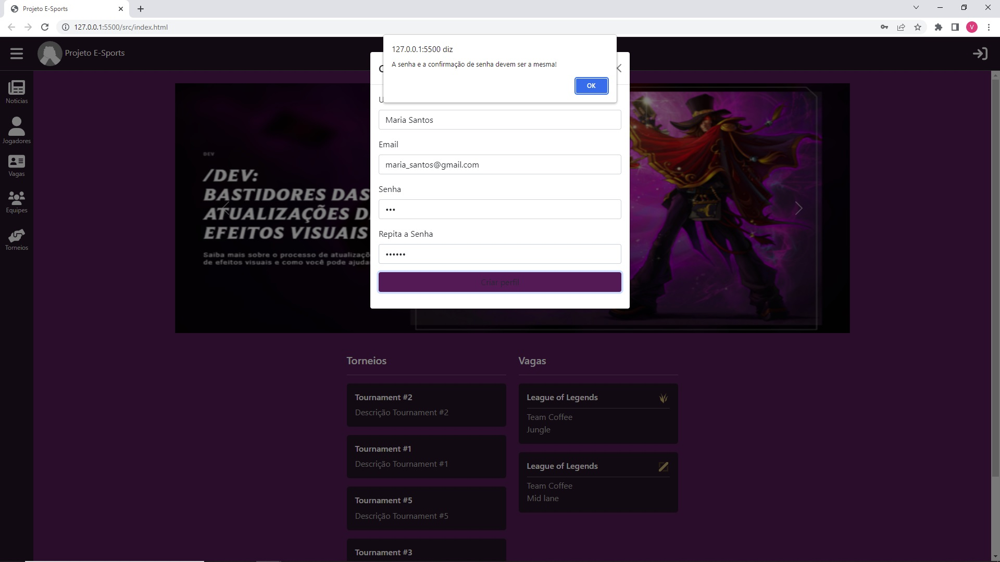
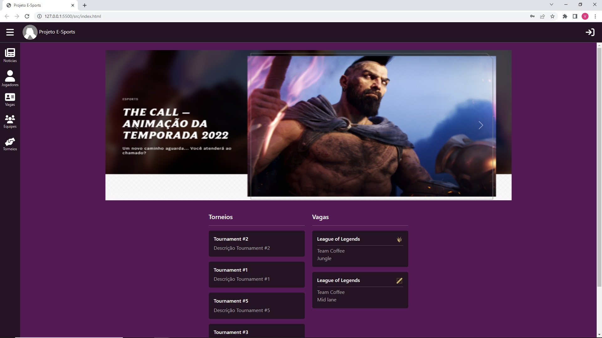
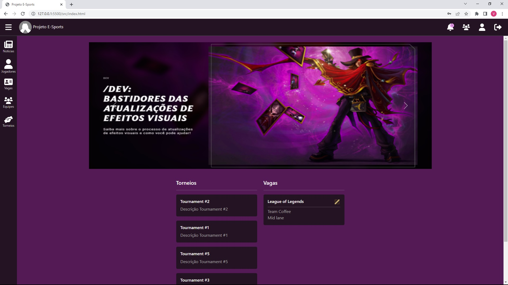
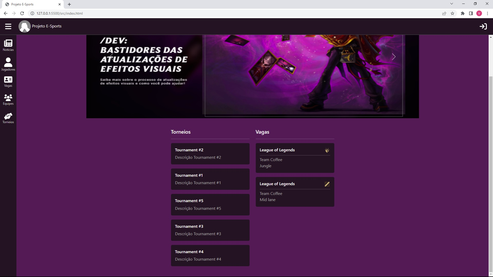
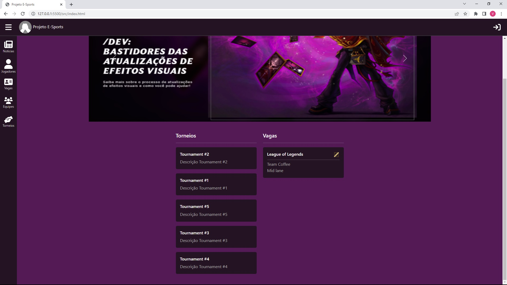
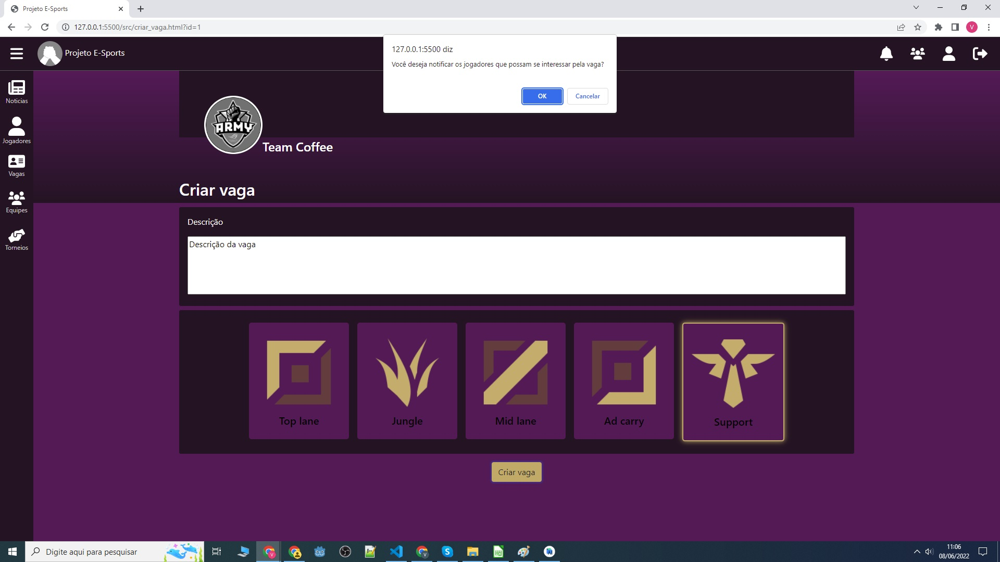
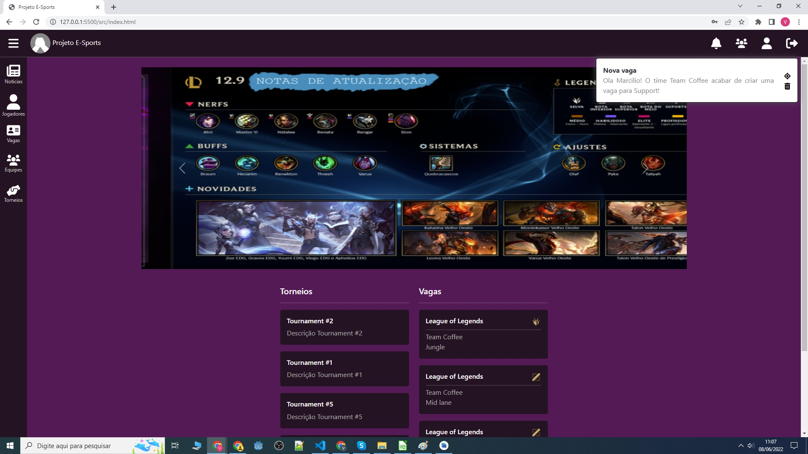

# Plano de Testes de Software

Pré-requisitos: <a href="2-Especificação do Projeto.md"> Especificação do Projeto</a>, <a href="3-Projeto de Interface.md"> Projeto de Interface</a>

Os requisitos para realização dos testes de software são:

  * Site publicado na Internet
  * Navegador da Internet - Chrome, Firefox ou Edge
  * Conectividade de Internet

Os testes funcionais a serem realizados no aplicativo são descritos a seguir.

Tabela de teste CT-01

Evidencias de teste

Tabela de teste CT-02

Evidencias de teste

Tabela de teste CT-03

Evidencias de teste

Tabela de teste CT-04

Evidencias de teste

Tabela de teste CT-05

Evidencias de teste

Tabela de teste CT-06

Evidencias de teste

Tabela de teste CT-07

Evidencias de teste

Tabela de teste CT-08

Evidencias de teste

Tabela de teste CT-09

Evidencias de teste

Tabela de teste CT-10

Evidencias de teste

Tabela de teste CT-11

Evidencias de teste

Tabela de teste CT-12

Evidencias de teste

Tabela de teste CT-13

Evidencias de teste

Tabela de teste CT-14

Evidencias de teste

Tabela de teste CT-15

Evidencias de teste

Tabela de teste CT-16

Evidencias de teste

Tabela de teste CT-17

Evidencias de teste

Tabela de teste CT-18

Evidencias de teste

Tabela de teste CT-19

Evidencias de teste

Tabela de teste CT-20

Evidencias de teste

Tabela de teste CT-21

Evidencias de teste

