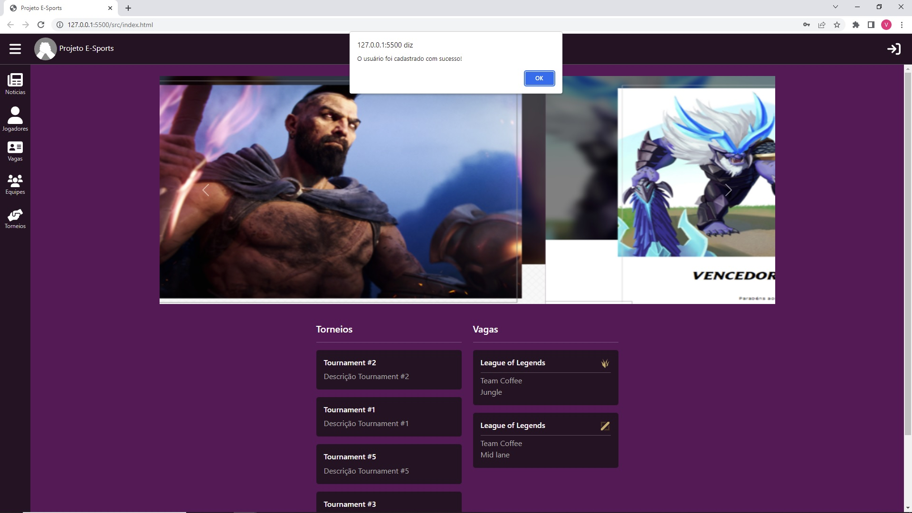
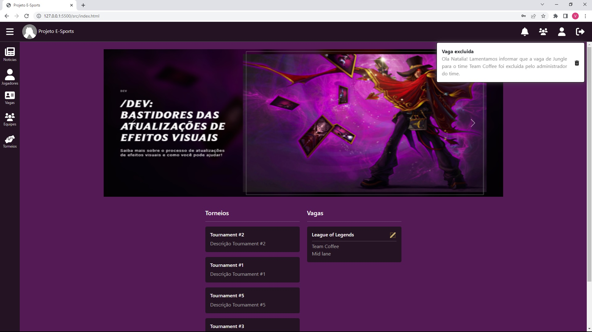

# Registro de Testes de Software

Pré-requisitos: <a href="3-Projeto de Interface.md"> Projeto de Interface</a>, <a href="8-Plano de Testes de Software.md"> Plano de Testes de Software</a>

Relatório com as evidências dos testes de software realizados no sistema pela equipe, baseado em um plano de testes pré-definido.

## CT-01

Este teste consiste em criar um usuário valido. Efetuando o preenchimento de todos os campos do formulário. 

Após a confirmação a página exibirá uma mensagem de sucesso. 

## CT-02

Este teste consiste na tentativa de criar um usuário inválido. Efetuando o preenchimento de todos os campos do formulário, porém, usando um e-mail já cadastrado no sistema. 

Após a confirmação a página exibirá uma mensagem de erro. 

## CT-03

Este teste consiste na tentativa de criar um usuário inválido. Efetuando o preenchimento de todos os campos do formulário, porém, usando uma senha e contra-senha diferentes. 

Após a confirmação a página exibirá uma mensagem de erro. 

## CT-04

Este teste verifica se o carrossel de notícias está sendo devidamente exibido.

## CT-05

Este teste verifica se a lista de vagas está sendo devidamente exibida.

## CT-06

Este teste verifica se a lista de torneios está sendo devidamente exibida.

## CT-07

Este teste verifica se a autenticação está sendo feita de forma correta. Primeiramente deve se preencher os campos com dados de um usuário devidamente registrado.

Após a confirmação o layout deverá mudar, exibindo novos icones relacionados a funções que o usuário poderá executar.

## CT-08

Este teste consiste da tentativa de autenticação com um e-mail que não está cadastrado.

Após a confirmação a página deverá exibir uma mensagem de erro.

## CT-09

Este teste consiste da tentativa de autenticação com um e-mail devidamente cadastrado, porém, usando uma senha invalida.

Após a confirmação a página deverá exibir uma mensagem de erro.

## CT-10

Este teste consiste apenas no acesso a uma vaga devidamente cadastrada sem autenenticação.

## CT-11

Este teste consiste apenas no acesso a uma vaga devidamente cadastrada com um usuário autenticado.

## CT-12

Neste teste um usuário cadastrado e que atenda aos requisitos da vaga, irá se candidatar a uma vaga.

Após confirmar sua candidatura a interface da página irá mudar para possibilidar a remoção da candidatura.

## CT-13

Neste teste um usuário cadastrado e já candidatado a vaga, irá remover sua candidatura.

Após confirmar remover sua candidatura a interface da página irá mudar para possibilidar uma nova candidatura.

## CT-14

Neste teste um usuário cadastrado e já candidatado à vaga, irá receber uma notificação após o administrador do time excluir a vaga em questão.

Efetuando a autenticação com o usuário candidato à vaga, será possível ver o ícone de notificação. 

E após abrir a lista de notificações, será possivel visualizar a notificação em questão.

## CT-15

Neste teste o administrador do time ao acessar a página de uma determinada vaga, irá visualizar uma lista com os candidatos a ela.

## CT-16

Este teste consiste na exclusão de uma vaga listada na página home.

## CT-17

Este teste consiste em convidar um jogador candidato a uma vaga.

Após a confirmação a interface da página, irá se atualizar.

## CT-18

Este teste consiste em desconvidar um jogador candidato a uma vaga.

## CT-19

Este teste consiste no processo completo para um jogador ingressar em um time.

A emissão de um convite.

E a notificação enviada quando ele é aceito.

## CT-20

Este teste consiste no processo completo para um jogador ingressar em um time, porem, o candidato rejeita o convite.

A emissão de um convite.

E a notificação enviada quando ele é rejeitado.

## CT-21

Este teste consiste em todo o processo para um administrador de time registrar uma vaga.
Primeiramente ele deve selecionar uma vaga, a descrição é opcional.

Após a conclusão, pode-se verificar que o sistema notifica aqueles jogadores que atendam aos requisitos e tem interesse em ser notificados.

## CT-29 

Este teste consiste em analisar se as vagas estão sendo exibidas de forma paginada e se sua navegação é eficiente e fluida.

## CT-30

Este teste consiste em analisar se as vagas estão sendo filtradas corretamente de acordo com o que o usuário digitar.

## Avaliação

Discorra sobre os resultados do teste. Ressaltando pontos fortes e fracos identificados na solução. Comente como o grupo pretende atacar esses pontos nas próximas iterações. Apresente as falhas detectadas e as melhorias geradas a partir dos resultados obtidos nos testes.

> **Links Úteis**:
> - [Ferramentas de Test para Java Script](https://geekflare.com/javascript-unit-testing/)
